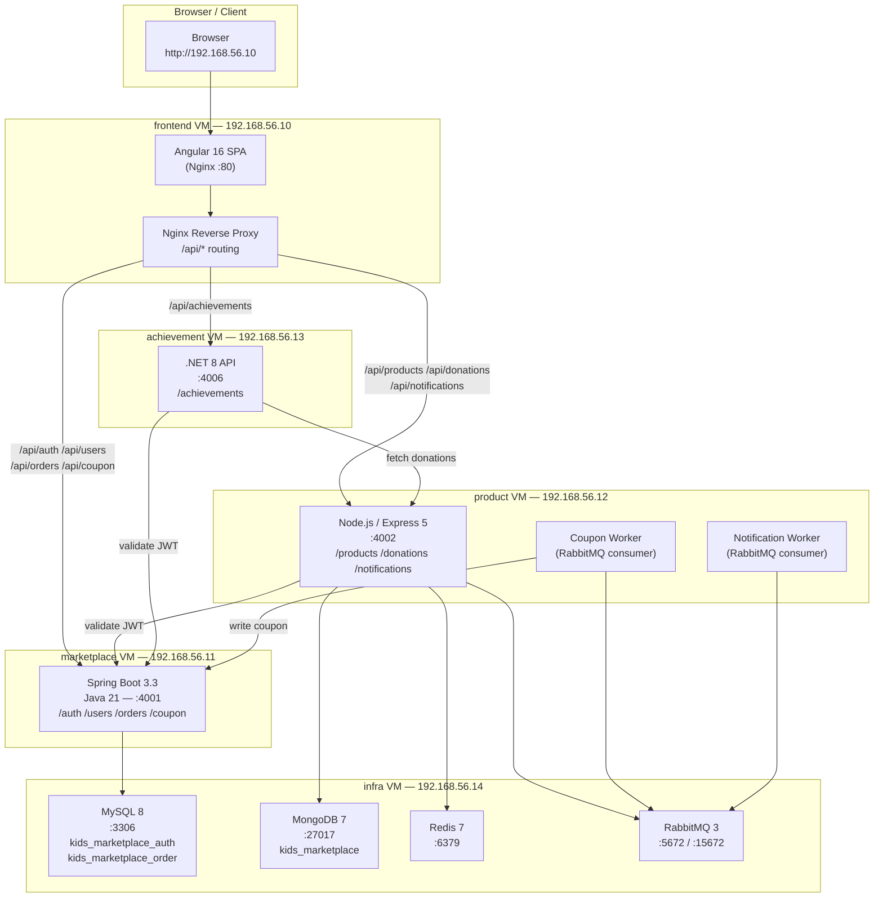
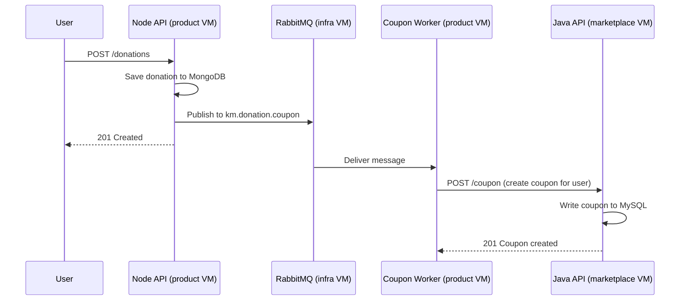
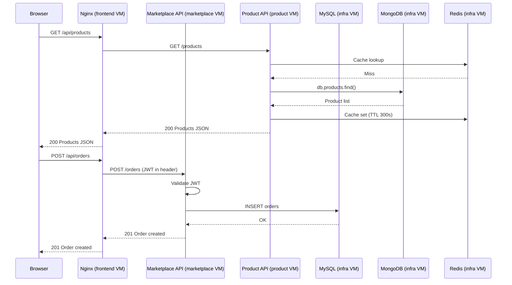

# KidzCart — Architecture Document

## 1. Overview

KidzCart is a children's marketplace and donation platform built as a **polyglot microservices** application. It is deployed across five VirtualBox VMs managed by Vagrant, each running Ubuntu 24.04. The system separates concerns across dedicated VMs for the frontend, three backend services, and shared infrastructure.

---

## 2. VM Topology

| VM Name       | Hostname      | IP              | RAM   | CPUs | Role                        |
|---------------|---------------|-----------------|-------|------|-----------------------------|
| `frontend`    | frontend      | 192.168.56.10   | 512 MB | 1   | Angular SPA + Nginx         |
| `marketplace` | marketplace   | 192.168.56.11   | 1 GB  | 1    | Java Spring Boot API        |
| `product`     | product       | 192.168.56.12   | 768 MB| 1    | Node.js API + Workers       |
| `achievement` | achievement   | 192.168.56.13   | 512 MB| 1    | .NET 8 API                  |
| `infra`       | infra         | 192.168.56.14   | 2 GB  | 2    | MySQL + MongoDB + Redis + RabbitMQ |

All VMs share a VirtualBox host-only private network (`192.168.56.0/24`).

---

## 3. System Architecture Diagram



---

## 4. Service Descriptions

### 4.1 Frontend — Angular SPA (`192.168.56.10`)

- **Technology:** Angular 16, TypeScript 5.1, served by Nginx
- **Build:** `ng build --configuration production` → static files in `dist/`
- **Routing:** Nginx serves the SPA and proxies `/api/*` to backend VMs
- **Proxy rules:**

| URL Pattern | Target VM |
|---|---|
| `/api/products`, `/api/donations`, `/api/notifications`, `/api/health` | product VM :4002 |
| `/api/auth`, `/api/users`, `/api/orders`, `/api/coupon` | marketplace VM :4001 |
| `/api/achievements` | achievement VM :4006 |

---

### 4.2 Marketplace Service — Java Spring Boot (`192.168.56.11`)

- **Technology:** Spring Boot 3.3.5, Java 21, Spring Security, Spring Data JPA
- **Port:** 4001
- **Database:** MySQL 8 on infra VM
  - `kids_marketplace_auth` — users, profile coupons
  - `kids_marketplace_order` — orders, order coupons
- **Auth:** JWT (HS256), shared secret across all services
- **Responsibilities:**
  - User registration and login (`/auth`)
  - User profile management (`/users`)
  - Order creation and history (`/orders`)
  - Coupon validation and redemption (`/coupon`)

---

### 4.3 Product & Donation Service — Node.js (`192.168.56.12`)

- **Technology:** Node.js 20 LTS, Express 5, Mongoose, ioredis, amqplib
- **Port:** 4002
- **Database:** MongoDB 7 on infra VM (`kids_marketplace` database)
- **Cache:** Redis 7 on infra VM (product list and detail caching)
- **Message broker:** RabbitMQ on infra VM
- **Processes (run concurrently):**
  - `server.js` — HTTP API for products and donations
  - `couponWorker.js` — consumes `km.donation.coupon` queue, calls marketplace service to create coupons
  - `notificationWorker.js` — consumes `km.notifications` queue for fan-out notifications
- **Responsibilities:**
  - Product catalogue CRUD (`/products`)
  - Donation submission and approval (`/donations`)
  - Notification delivery (`/notifications`)
  - Reverse-proxies auth/order calls to marketplace service

---

### 4.4 Achievements Service — .NET 8 (`192.168.56.13`)

- **Technology:** ASP.NET Core 8, C#, JWT Bearer auth
- **Port:** 4006
- **Dependencies:** No dedicated database — reads donation data from product service
- **Libraries:** QuestPDF (PDF report generation), Swashbuckle (Swagger UI)
- **Responsibilities:**
  - Track user achievements based on donation activity
  - Generate achievement PDF reports
  - Validate JWT tokens issued by marketplace service

---

### 4.5 Infrastructure VM (`192.168.56.14`)

| Service    | Port  | Purpose                                      |
|------------|-------|----------------------------------------------|
| MySQL 8    | 3306  | Relational data for auth, orders, coupons    |
| MongoDB 7  | 27017 | Document store for products and donations    |
| Redis 7    | 6379  | Product list/detail cache (optional but recommended) |
| RabbitMQ 3 | 5672  | Async message queue for coupon + notification workers |
| RabbitMQ Management UI | 15672 | Web UI for queue monitoring |

---

## 5. Data Architecture

### 5.1 MySQL Databases

```
kids_marketplace_auth
├── users          (id, name, email, password_hash, created_at)
└── coupons        (code, user_id, discount, used, created_at, expires_at)

kids_marketplace_order
├── orders         (id, user_id, items_json, subtotal, discount_applied, total, coupon_code, payment_status, created_at)
└── coupons        (code, user_id, discount, used, created_at, expires_at)
```

### 5.2 MongoDB Collections

```
kids_marketplace
├── products       (_id, name, category, price, description, image)
│   indexes: category, name
└── donations      (_id, userId, items[], note, status, createdAt)
    indexes: userId, status
```

---

## 6. Authentication & Security

- **JWT tokens** are issued by the marketplace service (Java) on login
- The **same secret** (`kids-marketplace-local-dev-secret-min-32b!`) is shared across all three backend services for token validation
- The product service and achievement service validate tokens by verifying the JWT signature locally — no inter-service auth call needed
- All inter-service communication is over the private `192.168.56.0/24` network — not exposed to the public internet

---

## 7. Async Messaging Flow



---

## 8. Request Flow — Buying a Product



---

## 9. Port Reference

| Service | VM | IP | Port |
|---|---|---|---|
| Angular (Nginx) | frontend | 192.168.56.10 | 80 |
| Spring Boot | marketplace | 192.168.56.11 | 4001 |
| Node.js / Express | product | 192.168.56.12 | 4002 |
| ASP.NET Core | achievement | 192.168.56.13 | 4006 |
| MySQL | infra | 192.168.56.14 | 3306 |
| MongoDB | infra | 192.168.56.14 | 27017 |
| Redis | infra | 192.168.56.14 | 6379 |
| RabbitMQ AMQP | infra | 192.168.56.14 | 5672 |
| RabbitMQ UI | infra | 192.168.56.14 | 15672 |

---

## 10. Technology Stack Summary

| Layer | Technology | Version |
|---|---|---|
| Frontend framework | Angular | 16.2 |
| Frontend language | TypeScript | 5.1 |
| Frontend server | Nginx | latest stable |
| Backend (auth/orders) | Spring Boot | 3.3.5 |
| Backend (auth/orders) language | Java | 21 |
| Backend (products/donations) | Express | 5.2 |
| Backend (products/donations) language | Node.js | 20 LTS |
| Backend (achievements) | ASP.NET Core | 8.0 |
| Backend (achievements) language | C# | 12 |
| Relational DB | MySQL | 8 |
| Document DB | MongoDB | 7 |
| Cache | Redis | 7 |
| Message broker | RabbitMQ | 3 |
| VM OS | Ubuntu | 24.04 |
| VM manager | Vagrant + VirtualBox | — |
