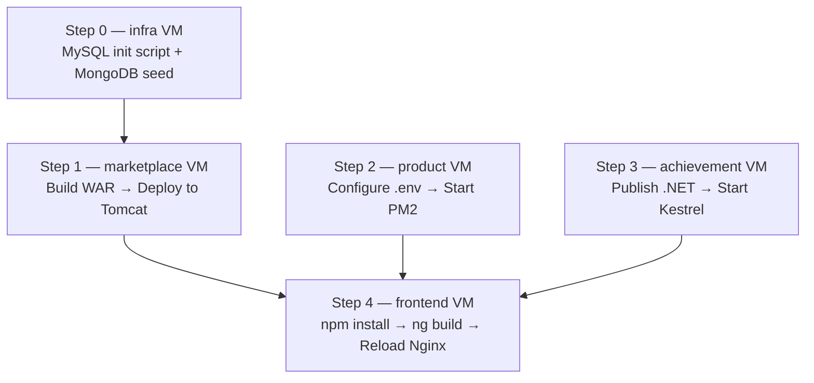

# KidzCart — Application Setup Guide

> **This guide covers application-level setup only.**
> All tools (Java, Maven, Tomcat, Node.js, PM2, .NET SDK, Nginx, MySQL, MongoDB,
> Redis, RabbitMQ) are installed and configured automatically by the Vagrant
> provisioning scripts when you run `vagrant up`.
>
> **Prerequisites:**
> - `vagrant plugin install vagrant-hostmanager` (one-time, on your host)
> - `vagrant up` — brings up all 5 VMs and runs provisioning scripts
> - Wait for all VMs to finish provisioning before starting the steps below

---

## VM Quick Reference

| VM | Hostname | IP | What's pre-installed |
|---|---|---|---|
| infra | infra | 192.168.56.14 | MySQL 8, MongoDB 7, Redis 7, RabbitMQ 3 |
| marketplace | marketplace | 192.168.56.11 | Java 21, Maven, Tomcat 10 (port 4001) |
| product | product | 192.168.56.12 | Node.js 20, PM2 |
| achievement | achievement | 192.168.56.13 | .NET 8 SDK, Nginx |
| frontend | frontend | 192.168.56.10 | Node.js 20, Nginx |

```bash
vagrant ssh <vm-name>   # e.g. vagrant ssh marketplace
```

---

## Application Setup Order



---

## Step 0 — infra VM: Initialise the databases

The infra provisioning script installs MySQL, MongoDB, Redis and RabbitMQ and
creates the MySQL `admin` user and empty databases. The schema, tables and seed
data must be loaded manually.

```bash
vagrant ssh infra
```

### 0.0 Clone the repository

```bash
git clone https://github.com/hkhcoder/kidzcart.git /opt/kidzcart
```

### 0.1 Run the MySQL schema + seed script

```bash
mysql -u admin -p'Admin@1234' < /opt/kidzcart/db/kids_marketplace_mysql_init.sql
```

Verify:

```bash
mysql -u admin -p'Admin@1234' -e "USE kids_marketplace_auth; SHOW TABLES;"
# Expected: coupons, users

mysql -u admin -p'Admin@1234' -e "USE kids_marketplace_order; SHOW TABLES;"
# Expected: coupons, orders
```

### 0.2 Run the MongoDB seed script

```bash
mongosh "mongodb://127.0.0.1:27017/kids_marketplace" \
    --file /opt/kidzcart/db/kids_marketplace_init.js
```

Verify:

```bash
mongosh "mongodb://127.0.0.1:27017/kids_marketplace" \
    --eval "db.products.countDocuments()"
# Expected: 26
```

---

## Step 1 — marketplace VM: Deploy the Java service

```bash
vagrant ssh marketplace
```

### 1.0 Clone the repository

```bash
git clone https://github.com/hkhcoder/kidzcart.git /opt/kidzcart
```

### 1.1 Build the WAR

```bash
cd /opt/kidzcart/services/marketplace-service
mvn package -DskipTests
```

This produces `target/marketplace-service-0.0.1-SNAPSHOT.war`.

### 1.2 Deploy to Tomcat

```bash
sudo rm -rf /opt/tomcat/webapps/ROOT*
sudo cp target/marketplace-service-0.0.1-SNAPSHOT.war \
        /opt/tomcat/webapps/ROOT.war
sudo chown tomcat:tomcat /opt/tomcat/webapps/ROOT.war
sudo systemctl start tomcat
```

### 1.3 Watch the startup log

```bash
sudo tail -f /opt/tomcat/logs/catalina.out
# Wait for: Started MarketplaceApplication in [X] seconds
```

### 1.4 Verify

```bash
curl http://localhost:4001/health
# Expected: {"ok":true,"service":"marketplace-service"}
```

---

## Step 2 — product VM: Start the Node.js service

```bash
vagrant ssh product
```

### 2.0 Clone the repository

```bash
git clone https://github.com/hkhcoder/kidzcart.git /opt/kidzcart
```

### 2.1 Copy the environment config

The `.env.example` file already has all VM IPs hardcoded. Just copy it:

```bash
cp /opt/kidzcart/services/product-donation-service/.env.example \
   /opt/kidzcart/services/product-donation-service/.env
```

### 2.2 Install dependencies

```bash
cd /opt/kidzcart/services/product-donation-service
npm install
```

### 2.3 Create the PM2 ecosystem file

PM2 manages all three processes (API server, coupon worker, notification worker)
without needing `concurrently`:

```bash
cat > /opt/kidzcart/services/product-donation-service/ecosystem.config.js << 'EOF'
module.exports = {
  apps: [
    {
      name: 'product-server',
      script: 'src/server.js',
      cwd: '/opt/kidzcart/services/product-donation-service',
      env_file: '/opt/kidzcart/services/product-donation-service/.env',
      restart_delay: 3000,
      max_restarts: 10,
    },
    {
      name: 'coupon-worker',
      script: 'src/workers/couponWorker.js',
      cwd: '/opt/kidzcart/services/product-donation-service',
      env_file: '/opt/kidzcart/services/product-donation-service/.env',
      restart_delay: 3000,
      max_restarts: 10,
    },
    {
      name: 'notification-worker',
      script: 'src/workers/notificationWorker.js',
      cwd: '/opt/kidzcart/services/product-donation-service',
      env_file: '/opt/kidzcart/services/product-donation-service/.env',
      restart_delay: 3000,
      max_restarts: 10,
    },
  ],
};
EOF
```

### 2.4 Start with PM2 and enable on boot

> **Important:** Run all PM2 commands as `root` (via `sudo -i`). PM2 saves the
> process list to the current user's home (`/root/.pm2`). The systemd startup
> hook must match the same user — otherwise PM2 won't restore processes on reboot.

```bash
sudo -i
cd /opt/kidzcart/services/product-donation-service
pm2 start ecosystem.config.js

# Generate the systemd startup hook for root
pm2 startup systemd -u root --hp /root
# PM2 prints a command — copy and run it exactly as shown, e.g.:
# sudo env PATH=$PATH:/usr/bin pm2 startup systemd -u root --hp /root

# Save the process list — this is what gets restored on every reboot
pm2 save
```

### 2.5 Verify

```bash
pm2 status
curl http://localhost:4002/health
```

---

## Step 3 — achievement VM: Start the .NET service

```bash
vagrant ssh achievement
```

### 3.0 Clone the repository

```bash
git clone https://github.com/hkhcoder/kidzcart.git /opt/kidzcart
```

### 3.1 Publish the application

```bash
cd /opt/kidzcart/services/achievements-service/AchievementsService

# Publish from the .csproj directly (avoids solution-level output path warning)
dotnet publish AchievementsService.csproj -c Release -o /opt/achievements
sudo chown -R achievements:achievements /opt/achievements
```

### 3.2 Enable and start the Kestrel systemd service

The systemd unit was created by the provisioning script. Enable and start it:

```bash
sudo systemctl enable --now achievements
```

### 3.3 Verify

```bash
# Kestrel direct (localhost only — internal port 5006, bypasses Nginx)
curl http://127.0.0.1:5006/health
# Expected: {"ok":true,"service":"achievements"}

# Via Nginx on port 4006 (the path other VMs use)
curl http://127.0.0.1:4006/health
curl http://achievement:4006/health

# Check logs
sudo journalctl -u achievements -n 30
```

---

## Step 4 — frontend VM: Build and serve the Angular app

```bash
vagrant ssh frontend
```

### 4.0 Clone the repository

```bash
git clone https://github.com/hkhcoder/kidzcart.git /opt/kidzcart
```

### 4.1 Install dependencies

```bash
cd /opt/kidzcart/frontend/kids-marketplace-ui
npm install
```

### 4.2 Build for production

The frontend VM has 512 MB RAM — set the Node heap limit to avoid OOM:

```bash
node --max-old-space-size=400 \
    ./node_modules/@angular/cli/bin/ng.js build
# Output: /opt/kidzcart/frontend/kids-marketplace-ui/dist/kids-marketplace-ui/
```

### 4.3 Reload Nginx

The Nginx site config and proxy rules were set up by the provisioning script.
After the build completes, reload Nginx to pick up the new dist files:

```bash
sudo systemctl reload nginx
```

### 4.4 Verify

Open a browser on your host:

```
http://frontend
# or http://192.168.56.10
```

The KidzCart UI should load and be able to browse products.

---

## Post-Setup Verification

Run these from your host to confirm all services are reachable:

```bash
# Infra services
mysql -h infra -u admin -p'Admin@1234' -e "SHOW DATABASES;"
mongosh "mongodb://infra:27017/kids_marketplace" --eval "db.products.countDocuments()"
redis-cli -h infra ping
# RabbitMQ UI: http://infra:15672  (admin/admin)

# Backend services
curl http://marketplace:4001/health
curl http://product:4002/health
curl http://achievement:4006/health

# Frontend
curl http://frontend
```

---

## Restarting Services After a Reboot

```bash
# infra — all services start automatically via systemd

# marketplace
vagrant ssh marketplace
sudo systemctl start tomcat

# product
vagrant ssh product
pm2 resurrect   # restores saved process list

# achievement
vagrant ssh achievement
sudo systemctl start achievements nginx

# frontend — Nginx starts automatically via systemd
```

---

## Troubleshooting

### Tomcat returns 403 on `/auth/health`
The health endpoint is at `/health`, not `/auth/health`. Test with:
```bash
curl http://localhost:4001/health
```

### Tomcat starts but Spring fails (datasource error)
Check `application.properties` has the correct infra IP and admin credentials:
```bash
cat /opt/tomcat/webapps/ROOT/WEB-INF/classes/application.properties
sudo tail -50 /opt/tomcat/logs/catalina.out
```

### npm install fails with EPROTO symlink error
VirtualBox shared folders don't support symlinks. Since the repo is now cloned to `/opt/kidzcart` (a native filesystem path), this error should not occur. If you see it, confirm you are working from `/opt/kidzcart` and not a shared folder mount.

### PM2 process keeps restarting
Check logs for the failing process:
```bash
pm2 logs product-server --lines 50
```
Confirm `.env` exists and all IPs/ports are reachable from the product VM.

### .NET service not reachable
Check both Kestrel and Nginx:
```bash
sudo systemctl status achievements nginx
sudo journalctl -u achievements -n 50
sudo nginx -t
```

### Angular build fails — out of memory

The frontend VM has 512 MB RAM. If the build runs out of memory, set the Node heap limit explicitly:

```bash
node --max-old-space-size=400 \
    ./node_modules/@angular/cli/bin/ng.js build
```

### MySQL connection refused from marketplace VM
Confirm MySQL is listening on `0.0.0.0` and the admin user has remote access:
```bash
# On infra VM
sudo ss -tlnp | grep 3306
mysql -u admin -p'Admin@1234' -e "SELECT user, host FROM mysql.user WHERE user='admin';"
```
